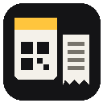

# The Pass (Home Assistant add-on)

A scan-only kitchen-island task loop. Cards are projects, printed as 4x6 labels on a TSPL label printer
over USB. Slips are tasks, printed on an ESC/POS network receipt printer. There's a projector page, a
scanner input page, and an HTTP API with outbound webhooks.

See DOCS.md for configuration.
